# Developer Guide

## Content Page
* [Content Page](#content-page)
* [Introduction](#introduction)
    * [Purpose](#purpose)
    * [Acknowledgements](#acknowledgements)
    * [Using the Developer Guide](#using-the-developer-guide)
* [Design](#design)
    * [Architecture Overview](#architecture-overview)
    * [Component Overview ](#component-overview )
      * [UI component](#ui-component)
      * [Parser component](#parser-component)
      * [Command component](#command-component)
      * [Storage component](#storage-component)
* [Implementation](#implementation)
    * [Add Command](#add-command)
      * [Add Expenditure](#add-expenditure-e)
      * [Add Credit Card](#add-credit-card-cc)
      * [Add Income](#add-income-i)
      * [Design Considerations](#addcommand-design-considerations)
    * [CalculateInputCommand feature](#calculateinputcommand-feature)
    * [List Command](#list-command)
      * [List Expenditure](#list-expenditure-e)
      * [List Credit Card](#list-credit-card-cc)
      * [List Income](#list-income-i)
      * [Design Considerations](#list-command-design-considerations)
    * [Delete Command](#delete-command)
      * [Delete Expenditure](#delete-expenditure-e)
      * [Delete Credit Card](#delete-credit-card-cc)
      * [Delete Income](#delete-income-i)
      * [Design Considerations](#delete-command-design-considerations)
    * [Update Command](#update-command)
      * [Update Expenditure](#update-expenditure-e)
      * [Update Credit Card](#update-credit-card-cc)
      * [Update Income](#update-income-i)
      * [Update Considerations](#update-command-design-considerations)
    * [Storage](#storage)
      * [Loading](#loading)
      * [Saving](#saving)
      * [Design Considerations](#storage-design-considerations)
* [Appendix Requirements](#appendix-requirements)
  * [Product scope](#product-scope)
  * [User Stories](#user-stories)
  * [Non-Functional Requirements](#non-functional-requirements)
  * [Glossary](#glossary)
* [Instructions for manual testing](#instructions-for-manual-testing)

 

## Introduction

**MindMyMoney** (M3) is a desktop app for managing users' personal finances, optimized for use via a
Command Line Interface (CLI). With the application, users can track their expenses across multiple payment methods,
calculate monthly expenditure, and set financial goals. The application is targeted at students looking to start
managing their personal finances.

 

### Purpose
This document specifies the architecture and software design decisions for the application, MindMyMoney. 
The intended audience of this document is the developers, designers, and software testers of MindMyMoney.

 

### Acknowledgements
We would like to thank [AddressBook-3](https://se-education.org/addressbook-level3/) for assisting us in developing
MindMyMoney.

 

### Using the Developer Guide
Along the guide you may encounter several icons. These icons will provide several useful information.
> **💡 Note:**
>- This tells you that there is additional information that is useful when you are using the application.

> **⚠️Warning⚠️**
> - This tells you that there is some **important** information you should take note of to prevent issues from arising
    when you are using the application.  

Click on the hyperlinks in the [content page](#content-page) to quickly navigate the developer's guide.

 

## Design
**MindMyMoney** is written fully in **Java 11** using  Object-Oriented Programming (OOP) paradigm to help structure and
organise the code. This enables the efficiency of future improvements and revisions.
Data stored in the application is saved into text files locally on the user's device.  

 

### Architecture Overview
  
Fig 1 - Architecture Diagram for MindMyMoney

The Architecture Diagram above shows the high-level design of the application. The **main components**
consist of:
- `MMM`: Initialises the components in the correct sequence and connects them with each other. Also holds the user's
expenditures in memory.
- `Ui`: The User Interface of the application and deals with interaction with the user.
- `Parser`: Deals with making sense of user commands.
- `Commands`: The collection of all executable commands.
- `Storage`: Reads data from, and writes data to the hard disk.

By abstracting out closely related code into classes, it allows `MMM` to deal at a higher level, without worrying
about the lower level details. Higher cohesion is also achieved and coupling is minimized.

 

The Sequence Diagram below shows an example of how the components interact with each other for the scenario 
where the user issues the command `add /e /pm cash /c food /d Porridge /a 3 /t 04/04/2022` to add an expenditure.

  Fig 2 - Sequence Diagram showing the Add Command

 

### Component Overview 
The major code is broken down into components for better abstraction. 
The sections below give more details for each component.

 

### UI component
The source code can be found in [`Ui.java`](https://github.com/AY2122S2-CS2113T-T10-4/tp/blob/master/src/main/java/seedu/mindmymoney/Ui.java)

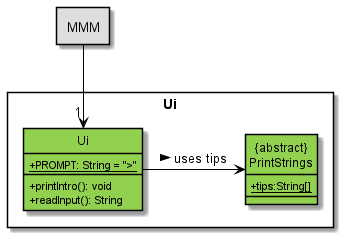
  Fig 3 - Ui Class Diagram

The UI component consists of a `Ui` and `PrintStrings` class.

The UI component:
- Prints the welcome banner and message on startup, as well as a financial tip from the `PrintStrings` class.
- Prints `>` before the user's input, to help the user differentiate between their input and an output from the
application.
- Reads input from the user.

 

### Parser component
The source code can be found in [`Parser.java`](https://github.com/AY2122S2-CS2113T-T10-4/tp/blob/master/src/main/java/seedu/mindmymoney/Parser.java)

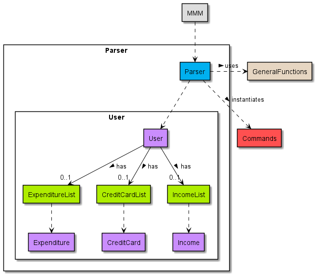
  Fig 4 - Parser Class Diagram

The Parser component consists of a `Parser` and `User` class. The `User` class further consists of an `ExpenditureList`, 
`CreditCardList` and `IncomeList` class, which makes use of the `Expenditure`, `CreditCard` and `Income` class respectively.

The Parser component:
- Receives user's input and splits it into the Command Type and Description using the `GeneralFunctions` class.
- Uses the `User` class and user's input to instantiate a `Command` object based on the Command Type.
- Returns the `Command` object that can then be executed.

We pass in the `User` class to the `Command` object instead of using a global variable to ease testing. This way, we can 
add, delete and update entries in a new `User` during testing without affecting the actual `User`.

 

### Command component 
The source can be found in [`command`](https://github.com/AY2122S2-CS2113T-T10-4/tp/blob/master/src/main/java/seedu/mindmymoney/command)

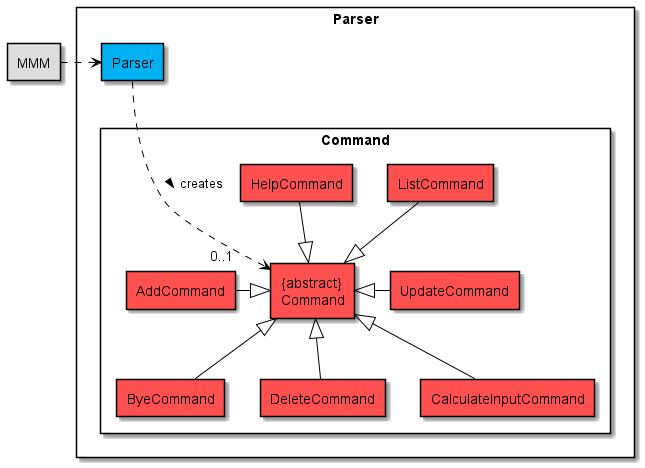  
Fig 5 - Command Class Diagram

The Command component consists of Command abstract class, `AddCommand`, `ByeCommand`, `DeleteCommand`, `HelpCommand`
,`CalculateInputCommand`, `ListCommand`and `UpdateCommand` that extends the `Command` class.

The Command component:
- Provides all the Command classes which can be instantiated by `Parser.parseCommand()`. The Command objects can then be 
executed. Only 1 Command object can be created.
- Includes a `Command.executeCommand()` method in each Command classes which performs the relevant command and throws 
exceptions if an error is encountered. The error is then handled.

 

### Storage component 
The source can be found in [`Storage.java`](https://github.com/AY2122S2-CS2113T-T10-4/tp/blob/master/src/main/java/seedu/mindmymoney/Storage.java)

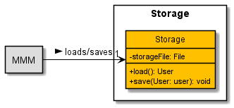  
Fig 6 - Storage Class Diagram

The Storage component consists of `Storage` class.

The Storage component:
- `MMM` class initialises a `Storage` object upon start up. The `Storage` class consists of 
`Storage.load()` and `Storage.save()` methods. 
- Concurrently, `MMM` will call the `Storage.load()` method and load any data that is stored on the hard disk.
- `MMM` calls the `Storage.save()` method and stores remaining data onto the hard disk when the program exits.

 

## Implementation
This section describes some noteworthy details on how certain features of MindMyMoney are implemented.

 

### Add Command
The source code can be found in [`AddCommand.java`](https://github.com/AY2122S2-CS2113T-T10-4/tp/blob/master/src/main/java/seedu/mindmymoney/command/AddCommand.java)

The Add Command feature allows users to add expenditures, credit cards or their income using a single command. 
This provides speed and ease of use by only requiring a single line of input.

The Add Command has 3 parts. These parts are differentiated by their flags:
- Add expenditure `/e`.
- Add credit card `/cc`.
- Add income `/i`.

The sequence diagram below shows the interactions when an `AddCommand` is executed.  

  
Fig 7 - AddCommand Sequence Diagram  

Below is an example showing how the AddCommand behaves at each step.
1. The `Parser` component parses user input and returns the new `AddCommand` object to the
   `MindMyMoney`.
2. `AddCommand` instantiates `addInput`, `expenditureList`, `creditCardList`, `incomeList`.
3. The application invokes `AddCommand.executeCommand()` to execute user instruction.
4. If user input contains `/e`, the application executes `AddCommand.addExpenditure()`.
5. Else user input contains `/cc`, the application executes `AddCommand.addCreditCard()`.
6. Else if user input contains `/i`, the application executes `AddCommand.addIncome()`.
7. The application then returns to the Parser component.

 

#### Add Expenditure `/e`
A key functionality of MindMyMoney is the ability to add and track user expenditure. Expenditures are added through
the `AddCommand.addExpenditure()` method, invoked when using the `/e` flag. Additional parameters `PAYMENT_METHOD`, 
`CATEGORY`, `DESCRIPTION`, `AMOUNT` and `TIME` are also required.

  
Fig 8 - Add Expenditure Command Sequence Diagram  

The sequence diagram above shows the interactions of different classes when adding an expenditure
to the list.

1. During the execution, `AddCommand.addExpenditure()` will parse through user input to obtain the `PAYMENT_METHOD`, `CATEGORY`,
   `DESCRIPTION`, `AMOUNT` and `TIME` fields.
2. Once all the fields are obtained, `AddCommand.addExpenditure()` will run tests for its respective fields.
3. The `AddCommand.addExpenditure()` object formats the `CATEGORY` and `AMOUNT` fields, and the `PAYMENT_METHOD` if it is cash.
4. The `AddCommand.addExpenditure()` object instantiates a new `Expenditure` object with the 5 fields and adds them
   into the `ExpenditureList`.
5. The `AddCommand.addExpenditure()` object prints a list to show the user what it has saved.
6. If user input for `PAYMENT_METHOD` is not cash, `AddCommand.addExpenditure()` invokes `AddCommand.updateCreditCardTotalExpenditure` to update the corresponding `creditCard.totalExpenditure`
7. The `AddCommand.addExpenditure()` returns to `AddCommand`.

 

#### Add Credit Card `/cc`
MindMyMoney allows users to track their different credit cards. Credit cards are added through the `AddCommand.addCreditCard()`
method, invoked when using the `/cc` flag. Additional parameters `CREDIT_CARD_NAME`, `CASHBACK` and `CARD_LIMIT` are also
required.

   
Fig 9 - Add Credit Card Command Sequence Diagram

The sequence diagram above shows the interactions of different classes when adding a credit card to the list.

1. During the execution, `AddCommand.addCreditCard()` will parse through user input to obtain the `CREDIT_CARD_NAME`, `CATEGORY`,
   `CASH_BACK` and `CARD_LIMIT` fields.
2. Once all the fields are obtained, `AddCommand.addExpenditure()` will run tests for its respective fields.
3. The `AddCommand.addCreditCard()` object instantiates a new `CreditCard`
   object with the aforementioned 3 fields and adds them into the `CreditCardList`.
4. The `AddCommand.addCreditCard()` object prints a list to show the user what it has saved.
5. The `AddCommand.addCreditCard()` returns to `AddCommand`.

 

#### Add Income `/i`
MindMyMoney allows users to track their sources of income. Incomes are added through the `AddCommand.addIncome()`
method, invoked when using the `/i` flag. Additional parameters `AMOUNT` and `CATEGORY` are also required.

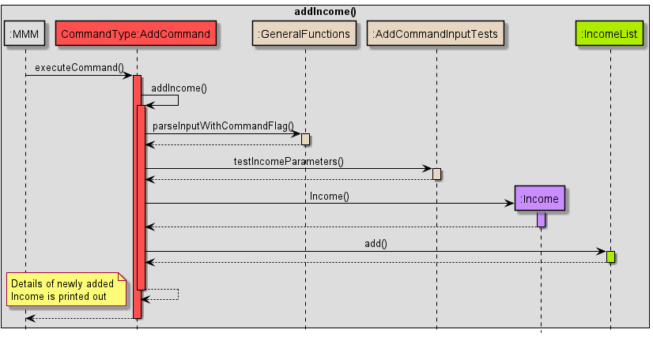
  Fig 10 - Add Income Sequence Diagram

The sequence diagram above shows the interactions of different classes when adding an income to the list.

1. After receiving the `AddCommand` object from `Parser`, `MMM` calls the `AddCommand.executeCommand()` method.
2. `AddCommand.addIncome()` method is invoked as the `/i` flag is present. It parses through the user's input to obtain 
`AMOUNT` and `CATEGORY` fields. It also runs tests on these fields to ensure the inputs are valid.
3. An `Income` object is instantiated using the aforementioned fields and is added into the `IncomeList`.
4. Control is returned to `MMM`.

 

#### AddCommand Design Considerations
Aspect: How to ask user for the fields of input.
* Alternative 1 (current choice): User is asked to put in all fields at once, separated using flags.
    * Pros: Faster input, user can enter an expenditure using a single input.
    * Cons: User must be able to remember all the flags and its sequence.

* Alternative 2: User is asked iteratively to put in all fields, prompted by a message after each input.
    * Pros: Beginner friendly, easily understandable, no need to remember flags.
    * Cons: Slower, implementation when user is familiar with the application.

 

### CalculateInputCommand feature
The source code can be found in [`CalculateInputCommand.java`](https://github.com/AY2122S2-CS2113T-T10-4/tp/blob/master/src/main/java/seedu/mindmymoney/command/CalculateInputCommand.java)
and [`Calculations.java`](https://github.com/AY2122S2-CS2113T-T10-4/tp/blob/master/src/main/java/seedu/mindmymoney/helper/Calculations.java)

MindMyMoney allows users to view their finances in a more meaningful manner by displaying the total expenditure and breakdown of expenses in a
bar chart format.

The CalculateCommand can take in 3 different `[DATE]` fields:
- `calculate /epm [DD/MM/YYYY]` allows user to calculate total expenditure of the specific date.
- `calculate /epm [MM/YYYY]` allows user to calculate total expenditure of the specific month.
- `calculate /epm [YYYY]` allows user to calculate total expenditure of the specific year.

 

  Fig 11 - Calculate Input Command Sequence Diagram

The sequence diagram above shows the interactions of different classes when calculating the expenditure.

1. After receiving the `CalculateInputCommand` object from `Parser`, `MMM` calls the `CalculateInputCommand.executeCommand()` method.
2. `GeneralFunctions.parseInput()` method is invoked to obtain the flag and date of the input.
3. If `/epm` flag is present. It calls `Calculations.calculateExpenditure()` method to obtain the total expenditure of the date specified.
4. During the execution of `Calculations.calculateExpenditure()`, the `GeneralFunctions.findItemInList()` is invoked to 
find the items that contain the specified date.
5. Afterwards, `Calculations.displayCalculationBreakdown()` is invoked to show the breakdown of expenses in a bar chart format.
6. If `/epm` flag is not present, MindMyMoneyException is thrown.

 

#### CalculateCommand Design Considerations
Aspect: How to allow users to have a better understanding of their own expenses.
* User is required to input either the date, month or year in order to calculate their expenses.
  * Pros: User can have a better understanding of their expenditure breakdowns by the specified time they want to look for.
  * Cons: User is required to fill in a date, and the date must be found in the list of expenditures.

* Use of bar chart to represent breakdown of expenses in the CalculateInputCommand.
  * Pros: Users can view their overall expenses in a bar chart format, which is easier to view at one glance.
  * Cons: Some users may not prefer to visualise their data in a bar chart format.

 

### List Command
The source code can be found in [`ListCommand.java`](https://github.com/AY2122S2-CS2113T-T10-4/tp/blob/master/src/main/java/seedu/mindmymoney/command/ListCommand.java)  

The List Command feature allows users to view their current expenditures, credit cards and incomes, using their
respective flags:
- List expenditure `/e`.
- List credit card `/cc`.
- List income `/i`.

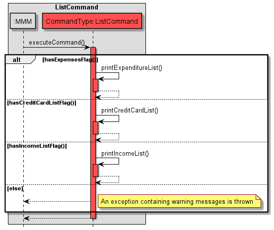
  Fig 12 - List Command Sequence Diagram

The sequence diagram above shows the interactions when a `ListCommand` is executed.
1. After receiving the `ListCommand` object from `Parser`, `MMM` calls the `ListCommand.executeCommand()` method.
2. If the expenses flag `/e` is present, it calls the `printExpenditureList()` method.
3. Else if the credit card flag `/cc` is present, it calls the `printCreditCardList()` method.
4. Else if the income flag `/i` is present, it calls the `printIncomeList()` method.
5. Else, it throws an error, which is then handled by printing an error message to the user.

 

#### List Expenditure `/e`
Allows the user to view their list of current expenditures. The list is printed through the `ListCommand.printExpenditureList()` 
method, invoked when using the `/e` flag.

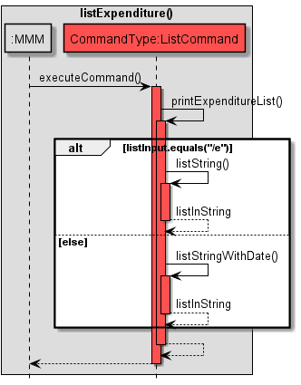
  Fig 13 - List Expenditure Sequence Diagram

The sequence diagram above shows the interactions when listing expenditures.
1. After receiving the `ListCommand` object from `Parser`, `MMM` calls the `ListCommand.executeCommand()` method.
2. `ListCommand.printExpenditureList()`method is invoked as the `/e` flag is present.
3. `ListCommand.expenditureListToString()` method is then invoked, which loops through the `expenditureList` and
concatenates each expenditure entry into a String `listInString`.
4. The `listInString` is returned which is then printed out.
5. Control is returned to `MMM`.

 

#### List Credit Card `/cc`
Allows the user to view their list of current credit cards. The list is printed through the `ListCommand.printCreditCardList()`
method, invoked when using the `/cc` flag.

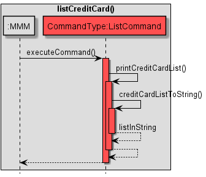
  Fig 14 - List Credit Card Sequence Diagram

The sequence diagram above shows the interactions when listing credit cards.
1. After receiving the `ListCommand` object from `Parser`, `MMM` calls the `ListCommand.executeCommand()` method.
2. `ListCommand.printCreditCardList()`method is invoked as the `/e` flag is present.
3. `ListCommand.creditCardListToString()` method is then invoked, which loops through the `creditCardList` and
   concatenates each credit card into a String `listInString`.
4. The `listInString` is returned which is then printed out.
5. Control is returned to `MMM`.

 

#### List Income `/i`
Allows the user to view their list of current incomes. The list is printed through the `ListCommand.printIncomeList()`
method, invoked when using the `/i` flag.

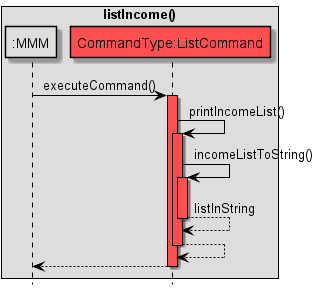
  Fig 15 - List Income Sequence Diagram

The sequence diagram above shows the interactions when listing incomes.
1. After receiving the `ListCommand` object from `Parser`, `MMM` calls the `ListCommand.executeCommand()` method.
2. `ListCommand.printIncomeList()`method is invoked as the `/i` flag is present.
3. `ListCommand.incomeListToString()` method is then invoked, which loops through the `incomeList` and
   concatenates each income entry into a String `listInString`.
4. The `listInString` is returned which is then printed out.
5. Control is returned to `MMM`.

 

#### List Command design considerations
Aspect: To ease testing of `ListCommand` using JUnit.
* Alternative 1 (current choice): Abstract the conversion of `Expenditure`, `CreditCard` and `Income` to `String` in a 
separate `ListCommand.listToString()` method.
  * Pros: Easily tested using JUnit by checking the String that the `ListCommand.listToString()` method returns.
  * Cons: Added layer of abstraction that may be deemed redundant.

* Alternative 2: Print directly in the `ListCommand.executeCommand()` method.
  * Pros: Easily implemented with lesser lines of code.
  * Cons: JUnit testing would require I/O redirection prior to checking the output matches expectations.

 

### Delete Command
The source code can be found in [`DeleteCommand.java`](https://github.com/AY2122S2-CS2113T-T10-4/tp/blob/master/src/main/java/seedu/mindmymoney/command/DeleteCommand.java)

The List Command feature allows users to delete an entry in their current expenditure, credit card or income list, using their
respective flags and followed by the index of the entry to be deleted:
- Delete an expenditure `/e [INDEX]`.
- Delete a credit card `/cc [INDEX]`.
- Delete an income `/i [INDEX]`.

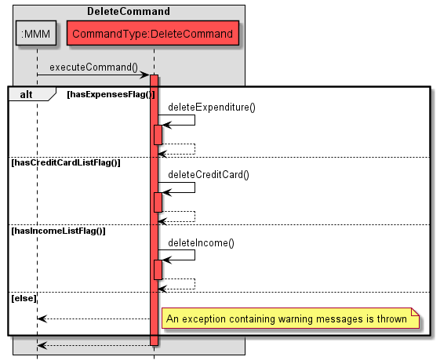
  Fig 16 - Delete Command Sequence Diagram

The sequence diagram above shows the interactions when a `DeleteCommand` is executed.
1. After receiving the `DeleteCommand` object from `Parser`, `MMM` calls the `DeleteCommand.executeCommand()` method.
2. If the expenses flag `/e` is present, it calls the `deleteExpenditure()` method.
3. Else if the credit card flag `/cc` is present, it calls the `deleteCreditCard()` method.
4. Else if the income flag `/i` is present, it calls the `deleteIncome()` method.
5. Else, it throws an error, which is then handled by printing an error message to the user.

 

#### Delete Expenditure `/e`
Deletes an expenditure entry specified by the user using the expenditure's index. The expenditure is deleted through the `DeleteCommand.deleteExpenditure()`
method, invoked when using the `/e` flag.

  Fig 17 - Delete Expenditure Sequence Diagram

The sequence diagram above shows the interactions when deleting an expenditure.
1. After receiving the `DeleteCommand` object from `Parser`, `MMM` calls the `DeleteCommand.executeCommand()` method.
2. `DeleteCommand.deleteExpenditure()`method is invoked as the `/e` flag is present.
3. `expenditureList.get()` method is then invoked, which retrieves the expenditure object to be deleted.
4. `Expenditure.getPaymentMethod()` is then used to check if the payment method was in `CASH`.
5. For Credit Card payment methods, the amount of expenditure is deducted from `CreditCard.totalExpenditure`. 
6. Details of the deleted expenditure is then printed out.
7. Control is returned to `MMM`.

 

#### Delete Credit Card `/cc`
Deletes a credit card specified by the user using the credit card's index. The credit card is deleted through the `DeleteCommand.deleteCreditCard()`
method, invoked when using the `/cc` flag.

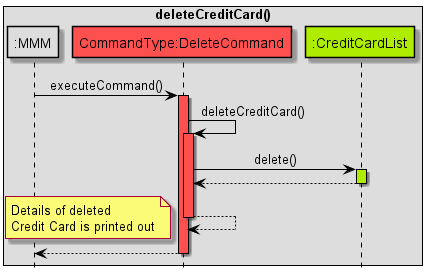
  Fig 18 - Delete Credit Card Sequence Diagram

The sequence diagram above shows the interactions when deleting a credit card.
1. After receiving the `DeleteCommand` object from `Parser`, `MMM` calls the `DeleteCommand.executeCommand()` method.
2. `DeleteCommand.deleteCreditCard()`method is invoked as the `/cc` flag is present.
3. `creditCardList.delete()` method is then invoked, which removes the specified index of Credit Card input by the user.
4. Details of the deleted Credit Card is then printed out.
5. Control is returned to `MMM`.

 

#### Delete Income `/i`
Deletes an Income specified by the user using the Income's index. The Income is deleted through the `DeleteCommand.deleteIncome()`
method, invoked when using the `/i` flag.

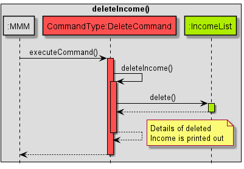
  Fig 19 - Delete Income Sequence Diagram

The sequence diagram above shows the interactions when deleting an Income.
1. After receiving the `DeleteCommand` object from `Parser`, `MMM` calls the `DeleteCommand.executeCommand()` method.
2. `DeleteCommand.deleteIncome()`method is invoked as the `/i` flag is present.
3. `IncomeList.delete()` method is then invoked, which removes the specified index of Income input by the user.
4. Details of the deleted Income is then printed out.
5. Control is returned to `MMM`.

 

#### Delete Command design considerations
Aspect: To print deleted object from User's list.
* Alternative 1 (current choice): Prints details of deleted Expenditure, Credit Card, or Income.
    * Pros: Users can easily verify that they have correctly deleted the object intended.
    * Cons: Printing extraneous lines onto the Command-Line may affect user-experience and find the output overwhelming.

* Alternative 2: Quietly delete the specified Expenditure, Credit Card, or Income.
    * Pros: Easily implemented.
    * Cons: Users are unable to verify that the correct object was deleted.

 

### Update Command
The source code can be found in [`UpdateCommand.java`](https://github.com/AY2122S2-CS2113T-T10-4/tp/blob/master/src/main/java/seedu/mindmymoney/command/UpdateCommand.java)

The Add Command feature allows users to update an expenditure, credit card, or income using a single command.
This provides speed and ease of use by only requiring a single line of input, when making amendments to an entry in their list.
- Update an expenditure `/e `.
- Update a credit card `/cc`.
- Update an income `/i `.

  Fig 20 - Update Command Sequence Diagram

The sequence diagram above shows the interactions when an `UpdateCommand` is executed.
1. After receiving the `UpdateCommand` object from `Parser`, `MMM` calls the `UpdateCommand.executeCommand()` method.
2. If the expenses flag `/e` is present, it calls the `updateExpenditure()` method.
3. Else if the credit card flag `/cc` is present, it calls the `updateCreditCard()` method.
4. Else if the income flag `/i` is present, it calls the `updateIncome()` method.
5. Else, it throws an error, which is then handled by printing an error message to the user.

 

#### Update Expenditure `/e`
Updates an expenditure entry specified by the user using the expenditure's index. The expenditure is updated through the `UpdateCommand.updateExpenditure()`
method, invoked when using the `/e` flag.

  Fig 21 - Update Expenditure Sequence Diagram

The sequence diagram above shows the interactions when updating an expenditure.
1. During the execution, `UpdateCommand.updateExpenditure()` will parse through user input to obtain the `PAYMENT_METHOD`, `CATEGORY`, `DESCRIPTION`, `AMOUNT` and `TIME` fields.
2. Once all the fields are obtained, `UpdateCommand.updateExpenditure()` will run tests for its respective fields.
3. The `UpdateCommand.updateExpenditure()` object formats the `CATEGORY` and `AMOUNT` fields, and the `PAYMENT_METHOD` if it is cash.
4. `UpdateCommand.updateExpenditure()` checks if the updated expenditure is similar to the old expenditure it is replacing and throws an error if it is.
5. If the old expenditure's `PAYMENT_METHOD` or new expenditure's `PAYMENT_METHOD` is not cash, `UpdateCommand.updateExpenditure()` invokes `UpdateCommand.updatePaymentMethod()` to update the corresponding `creditCard.totalExpenditure`.
6. The `UpdateCommand.updateExpenditure()` object instantiates a new `Expenditure` object with the 5 fields and sets it into the ExpenditureList.
7. Details of the updated `Expenditure` is printed out.
8. Control is returned to `MMM`.

 

#### Update Credit Card `/cc`
Updates a credit card specified by the user using the credit card's index. The credit card is updated through the `UpdateCommand.updateCreditCard()`
method, invoked when using the `/cc` flag.

  Fig 22 - Update Credit Card Sequence Diagram

The sequence diagram above shows the interactions when updating a credit card .
1. During the execution, `UpdateCommand.updateCreditCard()` will parse through user input to obtain the `CREDIT_CARD_NAME`, `CATEGORY`, `CASH_BACK` and `CARD_LIMIT` fields.
2. Once all the fields are obtained, `UpdateCommand.updateCreditCard()` will run checks prior to its insertion.
3. The `UpdateCommand.updateCreditCard()` object instantiates a new CreditCard object with the aforementioned 3 fields and sets them into the CreditCardList, at the specified index.
5. Details of the updated `Credit Card` is printed out.
6. Control is returned to `MMM`.

 

#### Update Income `/i`
Updates an Income specified by the user using the Income's index. The Income is updated through the `UpdateCommand.updateIncome()`
method, invoked when using the `/i` flag.

  Fig 23 - Update Income Sequence Diagram

The sequence diagram above shows the interactions when updating an Income.
1. After receiving the AddCommand object from Parser, MMM calls the `UpdateCommand.executeCommand()` method.
2. `UpdateCommand.updateIncome()` method is invoked as the `/i` flag is present. It parses through the user’s input to obtain `AMOUNT` and `CATEGORY` fields. It also runs tests on these fields to ensure the inputs are valid.
3. An `Income` object is instantiated using the aforementioned fields and is added into the `IncomeList`.
4. Details of the updated `Income` is then printed out.
5. Control is returned to `MMM`.

 

#### Update Command design considerations
Aspect: To allow updating of a similar object from User's list.
* Alternative 1 (current choice): Throws an exception and warns the user that the updated Expenditure, Credit Card, or Income is similar to the object they are replacing.
    * Pros: Users can easily verify that they have made a change in the updated object.
    * Cons: Implementing this requires extraneous checks and increased coupling.

* Alternative 2: Do not warn the user that the old object being replaced is similar to the new object.
    * Pros: Easily implemented.
    * Cons: Users may not be aware that the new object has no difference from the old object.

 

### Storage

Loads the user's saved information upon startup, and saves the information after every successful
command execution.

 

#### Loading

Loads the user's saved information upon startup.

 
Fig 21 - Loading Sequence Diagram

The sequence diagram above shows the interactions when loading user data.

1. On startup, `MMM` creates a `Storage` object that loads and saves data to `data.txt`. The `Storage` object
creates the file if it does not exist.
2. `MMM` then calls `Storage.load()`, which initializes a `Scanner` that reads the data file.
3. `Storage` invokes `User.deserializeFrom()`, which reads a serialized User over the `Scanner`.
4. `User` calls `ExpenditureList::deserializeFrom`, which returns an `ExpenditureList` read from the `Scanner`.
5. `User` then does the same for `CreditCardList::deserializeFrom` and `IncomeList::deserializeFrom`, which
return a `CreditCardList` and `IncomeList`, respectively.

 

Fig 22 - ExpenditureList Deserialization Sequence Diagram

The above sequence diagram shows the interactions when a list of 
`MMMSerializable`s is being deserialized. Although the given diagram shows the interaction for an 
`ExpenditureList`, the interactions for `CreditCardList` and `IncomeList` are similar.

1. `ExpenditureList` calls `SerializerFunctions.convertInputToList`, which accepts a function
that deserializes a line of input. Here, `Expenditure.deserialize` is passed to `convertInputToList`.
2. For each line in the input which corresponds to an `Expenditure`, `SerializerFunctions`
invokes `Expenditure.deserialize` on this line, which returns an `Expenditure`. This is repeated until
the designated terminator is read from the `Scanner`.
3. `Expenditure` invokes `PropertyList.deserialize` to convert the input line into a set of key-value pairs.
Then, it makes a series of `PropertyList::getValue` calls to obtain the values of each individual property.
4. Once all attributes have been processed, `Expenditure.deserialize` returns an `Expenditure`.
5. These expenditures are aggregated into an `ExpenditureList`, which is returned 
to the `deserializeFrom()` call.

#### Saving

Saves user information after every successful
command execution.

 

Fig 23 - Saving Sequence Diagram

The sequence diagram above shows the interactions when saving user data.

1. After every command, `MMM` invokes `Storage::save`.
2. `Storage` invokes `User::serialize`.
3. `User` calls `ExpenditureList::serialize`, which returns a `String`, representing the serialized 
`ExpenditureList`.
4. `User` then does the same for `CreditCardList::deserializeFrom` and `IncomeList::deserializeFrom`, which
   return `String`s representing a serialized `CreditCardList` and `IncomeList`, respectively
5. `User` compiles all these into one `String`, and returns this to `Storage`.
6. `Storage` writes the returned serialized `User` into the data file.

 

Fig 24 - ExpenditureList Serialization Sequence Diagram

The above sequence diagram shows the interactions when a list of
`MMMSerializable`s is being serialized. Although the given diagram shows the interaction for an
`ExpenditureList`, the interactions for `CreditCardList` and `IncomeList` are similar.

1. `ExpenditureList` calls `SerializerFunctions.addListToStringBuilder`, passing in an `ArrayList` of 
`Expenditure`s.
2. For each entry in the list, `SerializerFunctions`
   invokes `Expenditure.propetyList` on this line, which returns an `Expenditure`. This is repeated until
   the designated terminator is read from the `Scanner`.
3. `Expenditure` creates a `PropertyList` to stores its properties into.
   Then, it makes a series of `PropertyList::setValue` calls to save each of its attributes.
4. Once all attributes have been processed, `PropertyList::serialize` is called, and
this serialized `PropertyList` is returned by `Expenditure::serialize`.
5. These serialized expenditures are aggregated into an `String`, which is returned
   to the `deserializeFrom()` call.

#### Storage Design Considerations

Aspect: When to save user data.
* Alternative 1 (current choice): After every command.
  * Pros: User state is still saved when program exits in ways other than a `ByeCommand`.
  * Cons: Saving after every command may degrade performance.
* Alternative 2: At program exit (i.e. execution of `ByeCommand`).
  * Pros: Less overhead per command, due to not having to save.
  * Cons: User state is not saved when program exits otherwise (e.g. due to a crash).

Aspect: What format to use in saving user data.
* Alternative 1 (current choice): Custom key-value pair format.
  * Pros: Easy to read and modify by hand.
  * Cons: More involved implementation.
* Alternative 2: Java's default `java.io.Serializable` interface.
  * Pros: Is simple to implement.
  * Cons: Is non-human-readable, which violates the requirements of this project.
* Alternative 3: JSON.
  * Pros: Easy-to-read, widely established standard.
  * Cons: Requires external libraries.
* Alternative 4: Incremental list of changes to user data.
  * Pros: Improved performance, due to having to save less data after every command.
  * Cons: More difficult to modify by hand.

 

## Appendix Requirements

### Product scope

**Target user profile**
- a student beginner who wants to start managing their finances
- possess an income
- prefer desktop application
- is proficient in CLI
- can type fast
- prefers typing to mouse interactions

**Value proposition**
Manage finances containing multiple payment methods faster than a typical mouse/GUI driven app.

 

### User Stories

| Version | As a ... | I want to ...                                                           | So that I can ...                                                          |
|---------|----------|-------------------------------------------------------------------------|----------------------------------------------------------------------------|
| v1.0    | new user | have a 'help' command that lists the functions of the program           | view implemented features of the program                                   |
| v1.0    | user     | create an entry for expenditure                                         | -                                                                          |
| v1.0    | user     | list existing entries                                                   | view my expenses                                                           |
| v1.0    | user     | update existing entries                                                 | edit details of entries I have previously deleted                          |
| v1.0    | user     | remove existing entries                                                 | delete wrongly added entries                                               |
| v1.0    | user     | know if my command entered is invalid                                   | not expect a successful operation with bad inputs                          |
| v1.0    | user     | exit the application                                                    | -                                                                          |
| v1.0    | user     | see a welcome page after running the application                        | have a better user experience and know the application loaded successfully |
| v2.0    | user     | add a date to expenditure                                               | track my expenditure daily, monthly or yearly                              |
| v2.0    | user     | add my credit cards, with the credit card limits, cashback              | track my expenditure on my credit card                                     |
| v2.0    | user     | allocate my expenditure into categories                                 | know which main categories I spent the most on                             |
| v2.0    | user     | see a graph of my expenditures for each category                        | know the breakdown of my expenditures                                      |
| v2.0    | user     | add my income                                                           | see if I am spending beyond my income                                      |
| v2.0    | user     | list my income, credit card and expenditure separately                  | better visualise the separate lists instead of seeing all at once          |
| v2.0    | user     | see the help page for my income, credit card and expenditure separately | refer to the the specific help page that I need                            |
| v2.1    | user     | save and load my data                                                   | I am able to close and re run the application without losing data          |

### Non Functional Requirements

1. Should work on any mainstream OS as long as it has Java 11 or above installed.   
3. A user with above average typing speed for regular English text (i.e. not code, not system admin commands)
   should be able to accomplish most of the tasks faster using commands than using the mouse.

  
### Glossary

* Mainstream OS: Windows, Linux, Unix, OS-X  

## Instructions for manual testing

{Give instructions on how to do a manual product testing e.g., how to load sample data to be used for testing}
